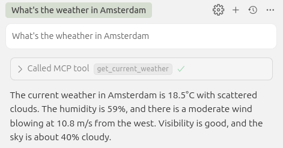
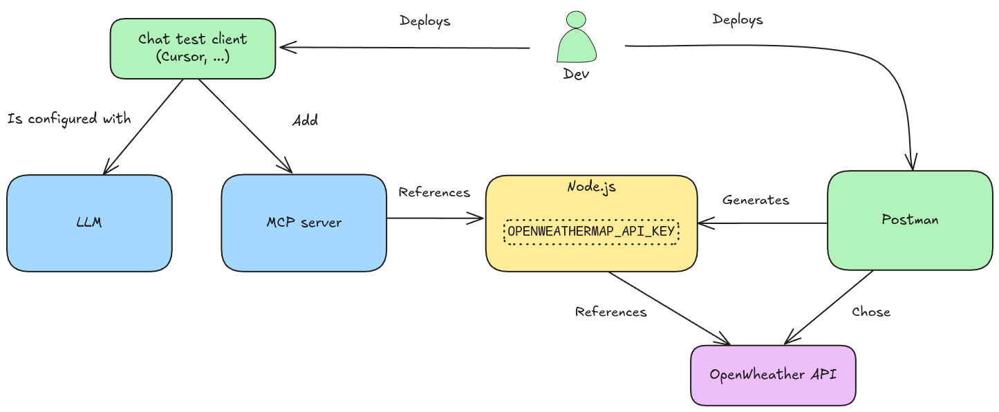
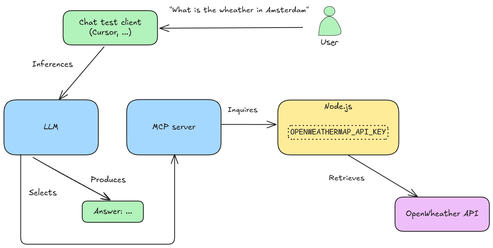

Generate and deploy an MCP-server (using Postman), and test it in a chat-client (using Cursor).

- https://javascript.plainenglish.io/i-stopped-building-frontends-now-i-use-mcp-servers-to-let-ai-run-my-apps-178b0d7107ca

Chat-client (test):

- Cursor IDE

MCP-server:

- Node.js
- Generated by Postman
- Connects to the OpenWheather API

# Install cursor IDE

https://www.cursor.com/

# Install postman

    sudo snap install postman

# Start postman

    postman

Login with an account > free plan.

# Generate server

In Postman:

- API network > MCP Generator
- Search > openwheathermap (by API Evangelist)
- Select APIs > Add Requests
- Generate
- Download ZIP
- Unzip ZIP

# Build server

In src:

    npm install

# Run server

    node mcpServer.js

# Add API key

API key is required to access the OpenWheather API (in this example).

In OpenWheather:

- Create account or sign-in
- Copy API key
- https://openweathermap.org/api

In src/.env:

- Paste API key (OPENWEATHERMAP_API_KEY)

Restart server:

    node mcpServer.js

# Enable agent

In Cursor > cursor settings > MCP tools > New MCP Server.

Add args: "your-dir/mcpServer.js".

- your-dir = where you unzipped the mcpServer

Observe a green dot, indicating that the "tools" (i.e. the wrapped APIs) in the MCP-server are enabled.

- Sometimes selecting the disable/enable switch is required

# Test agent

In cursor, observe models:

- Cursor settings > Models

Ask a question to the models:

- Ctrl-I > "What's the wheather in Amsterdam" > Accept

The models select the right tool and produce an answer:

# Design

## Deployment

## Runtime

